# Architecture Documentation

This document provides a comprehensive overview of the Security Monitoring Tool's architecture, including system design, component interactions, and data flow.

## Table of Contents

- [System Overview](#system-overview)
- [High-Level Architecture](#high-level-architecture)
- [Component Architecture](#component-architecture)
- [Data Flow](#data-flow)
- [Database Schema](#database-schema)
- [Deployment Architecture](#deployment-architecture)

---

## System Overview

The Security Monitoring Tool is a professional-grade security scanner designed to detect cross-origin web attack vulnerabilities, including dangling DNS records and subdomain takeover risks.

### Key Features

- **Multi-source subdomain discovery** (Certificate Transparency, subfinder, assetfinder)
- **Comprehensive DNS analysis** (A, AAAA, CNAME, MX records)
- **Intelligent detection** (dangling DNS, subdomain takeover across 8 platforms)
- **Flexible reporting** (JSON, HTML, Markdown, CSV)
- **Real-time alerting** (Email via SMTP, Slack via webhooks, generic webhooks)
- **Persistent storage** (SQLite with async operations)

### Technology Stack

- **Language:** Python 3.11+
- **Async Framework:** asyncio
- **HTTP Client:** aiohttp
- **REST API:** FastAPI + Uvicorn
- **Database:** SQLite (aiosqlite) with WAL journal mode
- **DNS Resolution:** dnspython
- **CLI Framework:** Typer
- **Templating:** Jinja2
- **Logging:** structlog
- **Type Checking:** mypy (strict mode)
- **CI/CD:** GitHub Actions

---

## High-Level Architecture

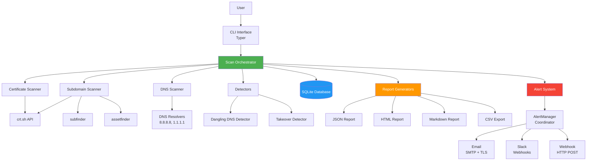

### Architecture Layers

1. **Presentation Layer** - CLI interface with Rich output, REST API with FastAPI
2. **Orchestration Layer** - Scan coordination, scheduling, and monitoring daemon
3. **Scanner Layer** - Data collection from multiple sources
4. **Detection Layer** - Vulnerability analysis and pattern matching
5. **Storage Layer** - Data persistence and retrieval
6. **Output Layer** - Reporting and alerting

---

## Component Architecture

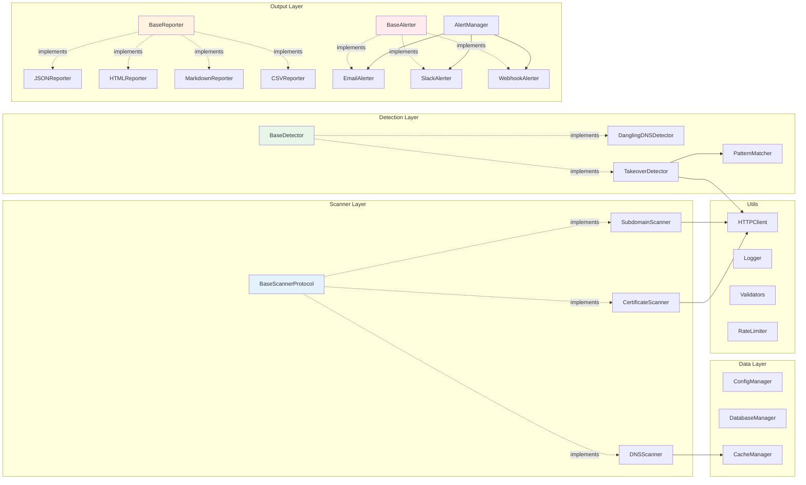

### Design Patterns

- **Protocol Pattern** - Interface definitions for extensibility
- **Factory Pattern** - Component creation and initialization
- **Strategy Pattern** - Multiple detection algorithms
- **Observer Pattern** - Event-driven alerting
- **Repository Pattern** - Data access abstraction
- **Singleton Pattern** - Logger and configuration

---

## Data Flow

### Complete Scan Workflow

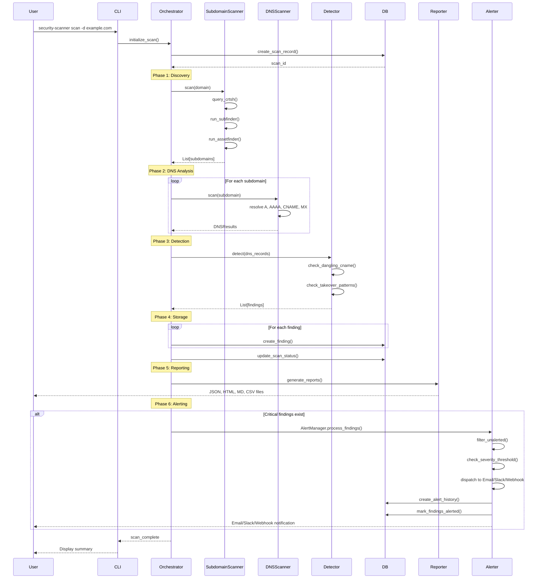

### DNS Resolution Flow

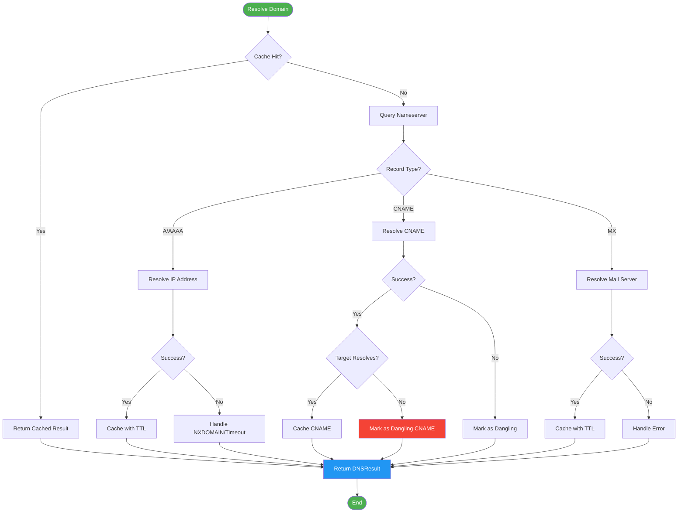

### Detection Logic Flow

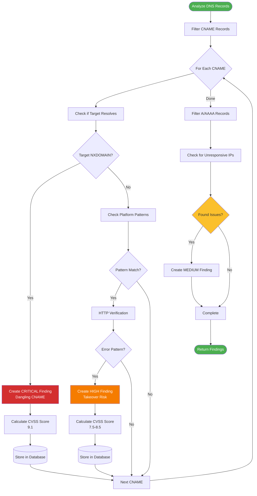

---

## Database Schema

### Entity Relationship Diagram

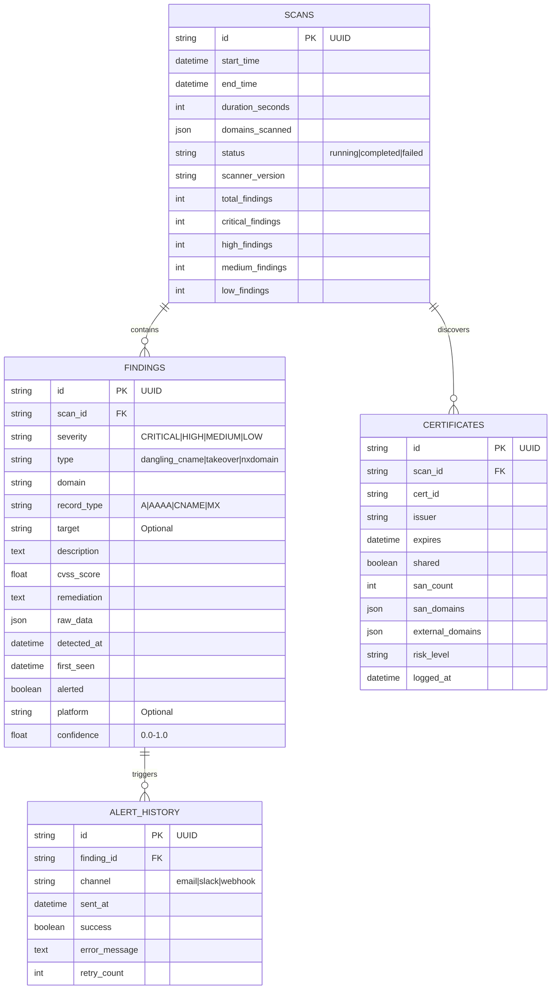

### Indexes

```sql
-- Performance-critical indexes
CREATE INDEX idx_findings_scan_id ON findings(scan_id);
CREATE INDEX idx_findings_severity ON findings(severity);
CREATE INDEX idx_findings_domain ON findings(domain);
CREATE INDEX idx_findings_detected_at ON findings(detected_at);
CREATE INDEX idx_scans_status ON scans(status);
CREATE INDEX idx_scans_start_time ON scans(start_time);
CREATE INDEX idx_certificates_scan_id ON certificates(scan_id);
CREATE INDEX idx_alert_history_finding_id ON alert_history(finding_id);
```

---

## Deployment Architecture

### Single-Server Deployment

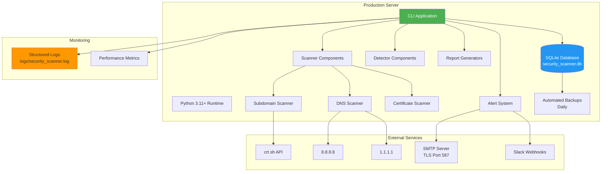

### Docker Deployment

```mermaid
graph TB
    subgraph "Docker Host"
        subgraph "Scanner Container"
            App[Security Scanner]
            Venv[Python venv]
            Code[Application Code]
        end

        subgraph "Volumes"
            Data[/data<br/>Database]
            Logs[/logs<br/>Log Files]
            Reports[/reports<br/>Generated Reports]
            Config[/config<br/>Configuration]
        end

        App --> Data
        App --> Logs
        App --> Reports
        App --> Config
    end

    subgraph "External"
        DNS[DNS Servers]
        APIs[External APIs]
        Email[Email Server]
        SlackAPI[Slack API]
    end

    App --> DNS
    App --> APIs
    App --> Email
    App --> SlackAPI

    style App fill:#4CAF50,color:#fff
    style Data fill:#2196F3,color:#fff
```

### Cron-Based Scheduling

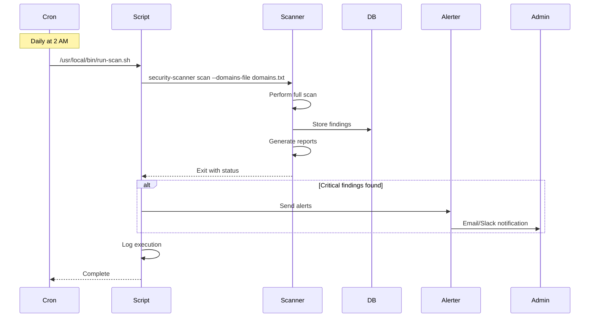

### Scaling Architecture (Future)

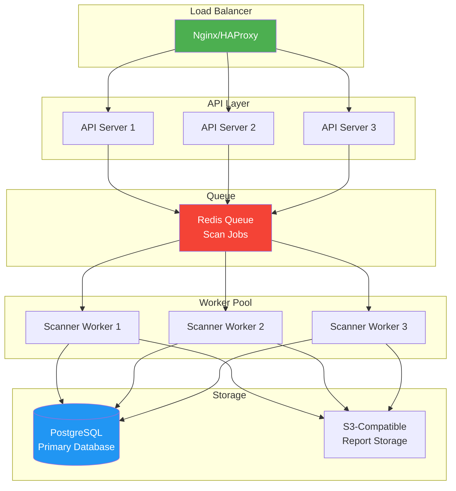

---

## System Components

### Core Components

| Component | Responsibility | Technology |
|-----------|---------------|------------|
| CLI | User interface, command parsing | Typer, Rich |
| REST API | HTTP API for programmatic access | FastAPI, Uvicorn |
| Orchestrator | Workflow coordination | asyncio |
| Scheduler | Scan scheduling and delta detection | asyncio |
| Monitor Daemon | Signal handling, graceful lifecycle | asyncio, signal |
| Subdomain Scanner | Subdomain discovery | aiohttp, subprocess |
| DNS Scanner | DNS resolution | dnspython |
| Certificate Scanner | CT log analysis | aiohttp |
| Dangling DNS Detector | Vulnerability detection | Custom logic |
| Takeover Detector | Pattern matching | Custom patterns |
| Database Manager | Data persistence | aiosqlite |
| Report Generators | Output formatting | Jinja2, csv |
| AlertManager | Alert coordination and dispatch | Custom |
| Alert System | Notifications | smtplib, aiohttp |

### External Dependencies

| Service | Purpose | Rate Limits |
|---------|---------|-------------|
| crt.sh | Certificate Transparency logs | 1-2 req/sec |
| DNS Resolvers | DNS resolution | No limit (public) |
| SMTP Server | Email delivery | Provider-dependent |
| Slack Webhooks | Slack notifications | 1 req/sec |
| Custom Webhooks | Generic HTTP POST alerts | Endpoint-dependent |
| subfinder | Subdomain enumeration | N/A (local) |
| assetfinder | Subdomain enumeration | N/A (local) |

---

## Performance Characteristics

### Throughput

- **Subdomain Discovery:** 100-500 subdomains/minute (varies by source)
- **DNS Resolution:** 50 concurrent queries (configurable)
- **Detection:** 1000+ records/second
- **Report Generation:** <1 second for 1000 findings

### Latency

- **Single DNS Query:** 50-200ms (network dependent)
- **Database Write:** <1ms (SQLite)
- **Report Generation:** 100-500ms
- **Email Alert:** 500-2000ms (network dependent)

### Resource Usage

- **Memory:** ~50-100MB baseline, +100KB per 1000 subdomains
- **CPU:** Minimal (I/O bound)
- **Disk:** ~10MB per 1000 findings (database)
- **Network:** ~100KB per subdomain scan

---

## Security Architecture

### Security Controls

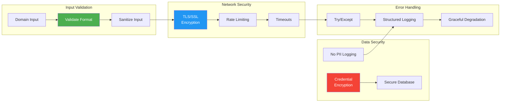

### Security Features

- ✅ Input validation (all user inputs)
- ✅ TLS/SSL encryption (email, HTTPS)
- ✅ No command injection (subprocess with list args)
- ✅ Rate limiting (respect API limits)
- ✅ Secure credential storage (environment variables)
- ✅ No PII in logs
- ✅ SQL injection prevention (parameterized queries)
- ✅ Timeout protection (all network operations)

---

## Monitoring & Observability

### Logging Architecture

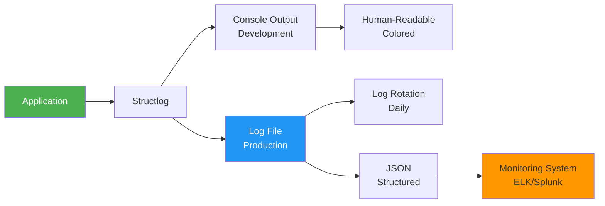

### Metrics Collected

- Scan duration
- Subdomains discovered
- DNS queries performed
- Findings by severity
- Alert success rate
- Error rates by component
- API response times

---

## Recent Architecture Additions

### REST API Layer (FastAPI)

The scanner exposes a full REST API for programmatic access:

- **Application factory** (`api/app.py`) with lifespan context manager
- **Dependency injection** via `AppState` singleton and FastAPI `Depends()`
- **Background task execution** for async scan processing
- **Pydantic v2 models** for request/response validation
- **Optional API key authentication** with timing-safe comparison
- **UUID validation** on path parameters to prevent traversal attacks

### Monitoring & Scheduling

- **ScanScheduler** (`scheduler.py`) — interval-based scan loop with delta detection
- **MonitorDaemon** (`monitor.py`) — signal handling, graceful shutdown, timeout management
- **AlertManager** (`alerters/manager.py`) — multi-channel dispatch with deduplication, severity filtering, fault isolation, and history recording
- Compares findings against 7-day history to identify new vulnerabilities
- Automatically dispatches alerts when new findings are detected

### Docker Deployment

- Multi-stage `Dockerfile` with non-root `scanner` user
- `docker-compose.yml` with API + monitor services and persistent volumes
- SQLite WAL journal mode for concurrent container access

## Future Architecture

### Planned Enhancements

1. ~~**Alerting Integration** - AlertManager with multi-channel dispatch~~ (Done)
2. **Web Dashboard** - Real-time monitoring UI
2. **Distributed Scanning** - Worker pool architecture
3. **PostgreSQL Support** - Enterprise database option
4. **Kubernetes Deployment** - Container orchestration via Helm charts
5. **Prometheus Metrics** - Advanced monitoring
6. **GraphQL API** - Flexible data queries

---

## Conclusion

The Security Monitoring Tool follows a modular, layered architecture that prioritizes:

- **Extensibility** - Protocol-based design for easy extension
- **Performance** - Async operations, caching, connection pooling
- **Reliability** - Comprehensive error handling, retries, logging
- **Security** - Input validation, secure communications, no sensitive data logging
- **Maintainability** - Type safety, clear separation of concerns, comprehensive documentation

The architecture supports both single-server deployments for small-scale use and can be extended to distributed architectures for enterprise-scale operations.

---

**Version:** 0.1.0
**Last Updated:** 2026-02-19
